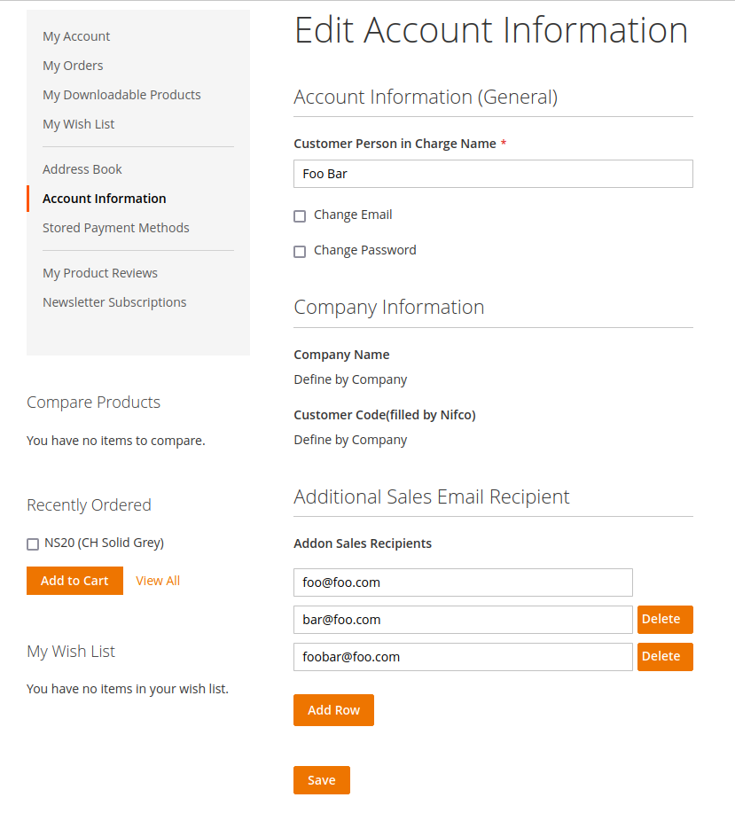

# Magento 2 Module GhoSter MultipleSalesRecipient

    composer require ghoster/module-multiplesalesrecipient

 - [Main Functionalities](#markdown-header-main-functionalities)
 - [Configuration](#markdown-header-configuration)

## Main Functionalities
Send multiple cc sales emails to the different recipients based on each customer.

## Configuration:
    Stores > Configuration > Customer > Multiple Sales Recipient

- Enable the module
- Limit number of additional sales emails

## Donation

If this project help you reduce time to develop, you can buy us some cups of beer :)

